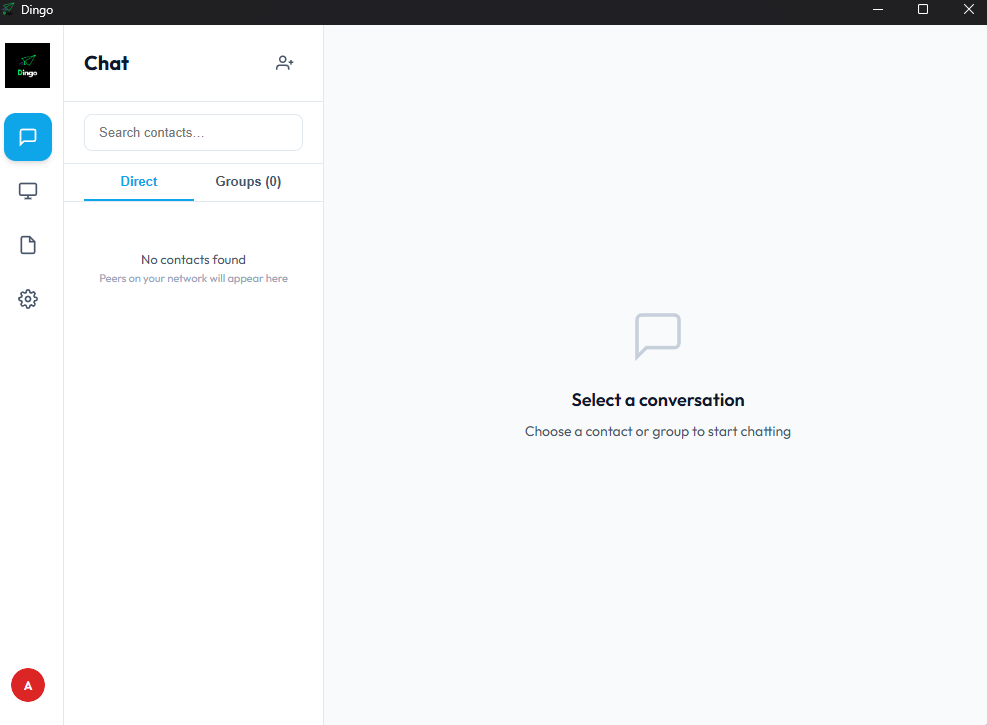
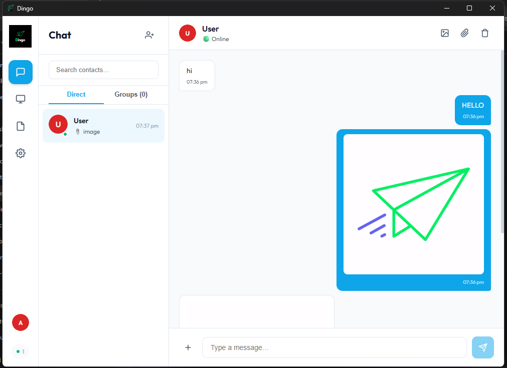

<div align="center">
  
  <h1>Dingo</h1>
  <p><strong>Secure P2P Desktop Messaging & File Sharing</strong></p>
  <p>
    <a href="https://github.com/SpreadSheets600/Dingo/actions">
      
    </a>
    <a href="https://github.com/SpreadSheets600/Dingo/releases">
      
    </a>
    <a href="LICENSE">
      
    </a>
    
    
    
    
  </p>
</div>

---

**Dingo** is a peer-to-peer desktop messaging and file-sharing application built with Rust and React. It enables direct, encrypted communication between devices on the same local network — no central server, no accounts, no cloud dependency.

---

## Features

- **End-to-End Encryption** — X25519 key exchange + AES-GCM-256 per-message encryption
- **Real-Time Messaging** — Instant text messaging over LAN with UDP discovery
- **File Sharing** — Chunked file transfer with resume support over HTTP
- **Screen Capture** — Share your screen directly using native Rust screen capture
- **LAN Discovery** — Automatic peer discovery via UDP broadcast
- **Group Chat** — Create group conversations with multiple peers
- **Notes** — Built-in note-taking with search and pinning
- **Offline Delivery** — Messages are queued and delivered when peers come online
- **Cross-Platform** — Windows, macOS, and Linux (desktop); Android support via Tauri mobile
- **No Account Required** — Privacy-first, no sign-ups, no servers

## Screenshots

<div align="center">
  
  
</div>

## Tech Stack

| Layer | Technology |
|-------|-----------|
| **Frontend** | React 19, React Router 7, Vite 7 |
| **Backend** | Rust, Tauri v2 |
| **Database** | SQLite via rusqlite |
| **Encryption** | x25519-dalek (X25519), aes-gcm (AES-256-GCM) |
| **Networking** | UDP (LAN discovery), HTTP (file transfer), WebSocket (relay) |
| **Mobile** | Tauri Android bindings |

## Installation

### Prerequisites

- **Node.js** 18+ (with pnpm: `npm install -g pnpm`)
- **Rust** stable (install via [rustup](https://rustup.rs))
- **System dependencies**:
  - **Windows**: [Microsoft C++ Build Tools](https://visualstudio.microsoft.com/visual-cpp-build-tools/) + WebView2 (preinstalled on Windows 10+)
  - **macOS**: Xcode Command Line Tools (`xcode-select --install`)
  - **Linux**: `libwebkit2gtk-4.1-dev libappindicator3-dev librsvg2-dev patchelf`

### Quick Start

```bash
# Clone the repository
git clone https://github.com/SpreadSheets600/Dingo.git
cd Dingo

# Install dependencies
pnpm install

# Run in development mode
pnpm tauri dev
```

The app will launch with hot-reload enabled. The frontend dev server runs on `http://localhost:1420`.

## Building

### Desktop Builds

```bash
# Build for the current platform
pnpm tauri build
```

Output artifacts:
- **Windows**: `src-tauri/target/release/bundle/nsis/Dingo_1.0.0_x64-setup.exe`
- **macOS**: `src-tauri/target/release/bundle/dmg/Dingo_1.0.0_x64.dmg`
- **Linux**: `src-tauri/target/release/bundle/appimage/Dingo_1.0.0_x64.AppImage`

### Android Build

```bash
# Build native libraries for Android
cd src-tauri
cargo ndk -t arm64-v8a -t armeabi-v7a -t x86_64 -t x86 build --release

# Copy frontend assets
cp -r ../dist/* gen/android/app/src/main/assets/

# Build APK
cd gen/android
./gradlew assembleRelease
```

### Build All (Windows + Android)

```powershell
# PowerShell (Windows)
.\build-all.ps1

# Bash (macOS/Linux/Git Bash)
./build-all.sh
```

### WebSocket Relay Server

The relay server enables cross-network connectivity. Deploy separately:

```bash
cd relay-server
npm install
node server.js
```

Default port: `8080` (configurable via `PORT` env var).

## Project Structure

```
dingo/
├── src/                          # React frontend
│   ├── components/               # UI components
│   ├── context/                  # React context providers
│   ├── hooks/                    # Custom React hooks
│   ├── lib/                      # Tauri IPC wrappers, WebSocket client
│   └── pages/                    # Route pages (chat, meetings, notes, settings)
├── src-tauri/                    # Rust backend
│   ├── src/
│   │   ├── commands.rs           # 70+ IPC command handlers
│   │   ├── crypto.rs             # X25519 + AES-GCM encryption
│   │   ├── db.rs                 # SQLite database layer
│   │   ├── discovery.rs          # LAN UDP peer discovery
│   │   ├── file_server.rs        # HTTP file sharing server
│   │   ├── file_transfer.rs      # Chunked file transfer
│   │   ├── lib.rs                # Tauri app entry point
│   │   ├── screen_capture.rs     # Native screen capture
│   │   ├── signaling.rs          # UDP signaling server
│   │   └── tray.rs               # System tray integration
│   ├── icons/                    # Application icons
│   └── tauri.conf.json           # Tauri configuration
├── relay-server/                 # WebSocket relay server (Node.js)
├── build-all.sh                  # Cross-platform build script
└── build-all.ps1                 # Windows build script
```

## Configuration

### Environment Variables

| Variable | Description | Default |
|----------|-------------|---------|
| `PORT` | Relay server port | `8080` |
| `TAURI_DEV_HOST` | Vite dev server host | `localhost` |
| `DINGO_INSTANCE` | Multi-instance discriminator (for testing) | — |
| `ANDROID_HOME` | Android SDK path | `~/Android/Sdk` |
| `ANDROID_NDK_HOME` | Android NDK path | auto-detected |

## Contributing

1. Fork the repository
2. Create a feature branch (`git checkout -b feature/amazing-feature`)
3. Make your changes
4. Run `cargo test` to verify Rust tests
5. Commit your changes (`git commit -m 'Add amazing feature'`)
6. Push to the branch (`git push origin feature/amazing-feature`)
7. Open a Pull Request

## License

Distributed under the MIT License. See `LICENSE` for more information.

---

<div align="center">
  <p>Built with ❤️ by <a href="https://github.com/Abhranil2004">Abhranil Dutta</a></p>
</div>
